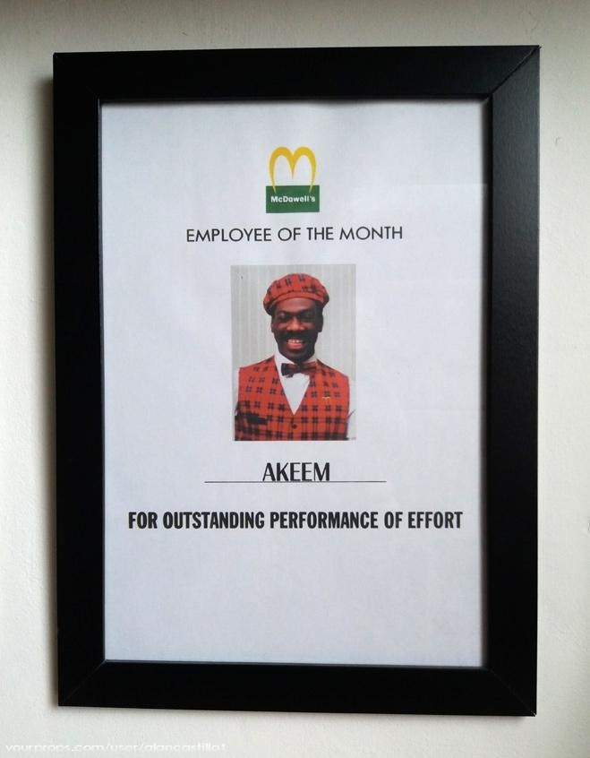

# Contra-NDA

**TLDR: Companies want NDA from me as candidate; I as candidate want Contra-NDA from companies.**
More info at https://github.com/panchul/contra-nda

---

Dedicated to prince Akeem from Coming to America (c) 1988 Paramount Pictures, Eddie Murphy Productions.

## Contra-NDA Manifesto

We all want to be happy, we seek belonging to environment that facilitates achieving that.

Happiness is often associated with money, and common lawful acquiring of money is associated with being employed.

If you are approaching me with a job opportunity, as a candidate, I would like to have a quick pre-screen to see if it is worth the time.

Please confirm that the following requirements are met.

---

## 1. The interview process is bona fide search for additions to the team.

- It is not an attempt to advertise your APIs, products, or services.
- It is not for making the existing team members feel replaceable.
- It is not to seek free external advice on your systems.

## 2. Negotiating salary at the beginning of the process does not make any sense.

- There is simply not enough information to have an opinion about how useful my skill set could be.
- And there is not enough information about what stock options, or non-monetary perks and opportunities might there be.

## 3. If you use take-home tests, make sure they are generic enough.

- Software exercises should not contain the libraries of your company, it is not fair for a candidate to invest time into learning your products.
- While I obviously would like to know about the company, interviews should not be free promos.
    - Please do not overwhelm me with your marketing material.
    - I will not start subscribing to your channels.

## 4. It is a direct-hire job.

- Contracting is a service, service is not scalable, and less lucrative in the grander scheme of things.
- Please do not offer me a "direct-hire to work on our best client" - it is obviously modern-era slavery.
- I want to be an official co-author of the patents, papers, other material that I help to create.

## 5. Before accepting a job offer I would like to know who my boss will be.

- I should be certain that he is qualified to make judgement of my performance.
- I want to see that he is willing and capable to help me in my growth (career/business).

.

.

___________ Recruiter/sourcer name

___________ Company name

___________ Company links
